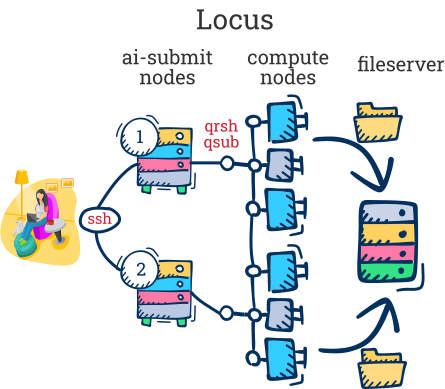
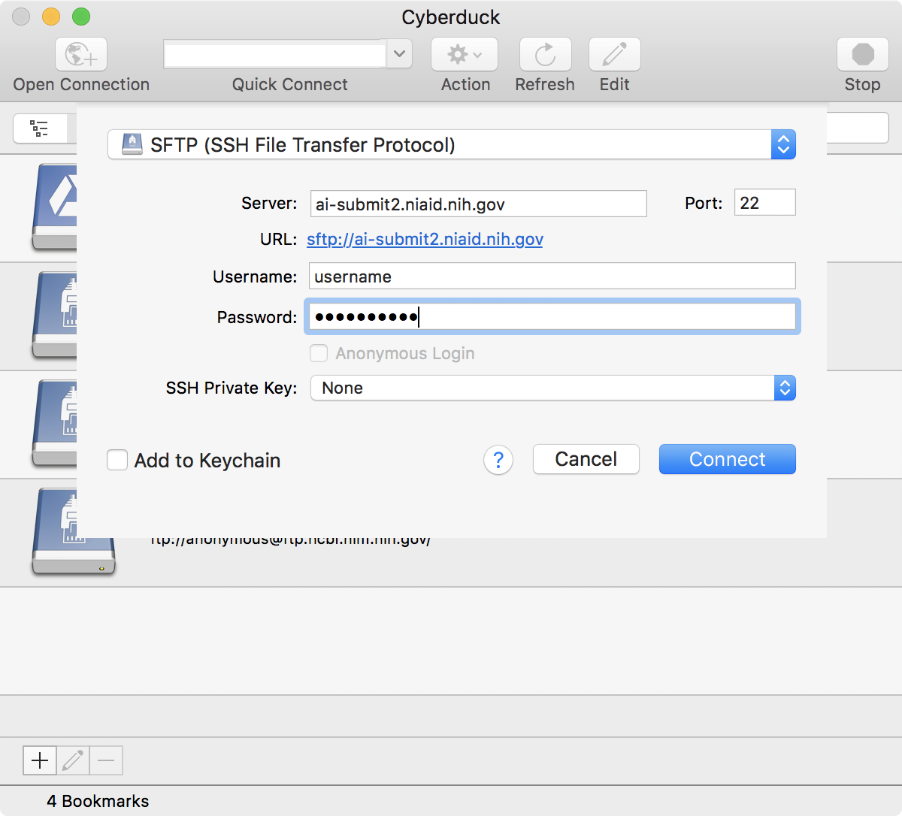

## When should you use a High Performance Cluster

- You need resources not available on your local laptop

- You need to run a program (job) that will run for a
very long time

- You need to run a job that can make use of parallel
computing

# NIAID Locus

Operating system is RedHatEnterpriseServer

For job scheduling system, the NIAID specific HPC- Locus uses Sun Grid Engine (SGE), which is different from the Slurm on Biowulf. Therefore many of the commands are not the same. 

- [Login via ssh](#login-via-ssh)
- [Interactive session](#interactive-session)
- [Access folders](#access-folders)
- [Basic unix commands](#basic-unix-commands)
- [Batch job](#batch-job)
- [More information for the curious](#more-information-for-the-curious)



## How to request access to LOCUS

to have an account on LOCUS, email your request to NIAIDHPCSUPPORT@niaid.nih.gov

For Mac users, you can use ssh from Terminal Window.
Also need Xquartz for X Window (graphic) applications: https://www.xquartz.org/

For PC users, you need to install and ssh client – such as
MobaXterm or Cygwin, Putty and Winscp :

http://mobaxterm.mobatek.net/

http://www.cygwin.com

http://www.chiark.greenend.org.uk/~sgtatham/putty/download.html

http://winscp.net

## Login via ssh

```bash
ssh -X username@ai-submit2.niaid.nih.gov
## enter password
```

## Interactive session

```bash
qrsh -l h_vmem=16G
```

- `h_vmem` is the maximum amount of memory you will be allowed to use.  You should set this parameter based on how big the files are that you will be working with.  16 gigabytes should be sufficient for the datasets in this seminar.

## Access folders

### Mount folders to laptop

- **Mac**: in Finder, Cmd+K smb://locusfileserver.niaid.nih.gov/username
- **Windows**: \\\locusfileserver.niaid.nih.gov\username

### Access folders via sftp

- alternate way to access folders if mounting doesn't work

- [Cyberduck](https://cyberduck.io/) -> Open Connection (icon top left of the window) 



## Basic unix commands

- [Cheat sheet](https://web.stanford.edu/class/physics91SI/handouts/04_UNIX_Commands.pdf); [Longer cheat sheet](http://www.mathcs.emory.edu/~valerie/courses/fall10/155/resources/unix_cheatsheet.html)

```bash
## list files in directory
ls

## get the path to your current directory
pwd

## change to another directory (replace directoryname with name of directory)
cd directoryname

## change to the directory above
cd ..

## change to your home directory
cd

## copy a file
cp file path/to/new/location
# copy a directory
cp -r directory newdirectory

## move a file
mv file path/to/new/location

## look at a file (replace filename)
less filename
## to quit less - type `q`

## get help - replace command with the command/program you need help with
man command
command -h | less

## delete files - CAUTION!  There is no recycling bin.  Files removed are gone forever. (well, technically, Locus makes backups, but only once a day)
rm file
rm -r directory

## print the content of a file to the screen
cat file

## make a new directory
mkdir newdirectory

## establish a new text file
nano file

## find the file/folder sizes in the current working directory
du -sh *
```


### Locus-specific commands

- also see batch job section below

```bash
## load module - replace modulename with the program (e.g. fastqc)
module load modulename
## unload one module
module unload modulename
## unload all modules (in case you get an error when you load one)
module purge
# default module to load - allows qsub and qrsh to run
module load uge 

## list all loaded modules
module list
## search for module versions
module avail modulename
## get info on module
module info modulename

## close your interactive session or log out of locus
exit
```


## Batch Job

- [Locus documentation](https://locus.niaid.nih.gov/userportal/documentation.php#Getting-Started/Submitting-your-First-Job)
- [job_submit.sh](../job_submit.sh)
- Submit job

```bash
qsub job_submit.sh
```

- A few useful options for qsub

- Find relative directory from the current directory

```bash
-cwd
```
- Send standard output (error) stream to a different file

```bash
-o path/filename
-e path/filename
```

- Check on job while running

```bash
qstat -u username
qstat -j jobid
```

- Get info about job after it's done running

```
qacct -j jobid
```

- Get info about job while running

```bash
qstat -j jobid | grep usage 
```

- Check the running processes on the current node
```
htop
```

- Delete a runing job that you don't need it anymore

```
qdel jobid
```

## More information for the curious

[Locus website](https://locus.niaid.nih.gov) - if you don't have a Locus server account, the first time you log into the website (using your regular NIH creds), you will get an email telling you how to request an account.

[BCBB unix class materials](https://github.com/niaid/ACE/tree/master/unix) - look at pptx slides for info about the commands in the scripts

### Copy folders from Locus to Laptop via command line

```bash
## example command: replace username with your username!
scp -r username@ai-submit2.niaid.nih.gov:/classhome/username ~/Desktop

 ## basic command structure
 ## `-r` means "recursive" so we copy the folder and everything in it.
 scp -r fromfoldername tofoldername

 ## general command
 scp -r username@servername:serverfolderpath laptopfolderpath
```

You could also use rSyn
rSyn -r username@ai-submit2.niaid.nih.gov:/classhome/username ~/Desktop/myfolder

### the Jupyter hub hosted by Locus

https://ai-submit2.niaid.nih.gov:10101/

To install packages to the python kernel, you need to login Locus and arsh to a node.

```bash
module load Anaconda3/5.3.0

source activate /sysapps/cluster/software/Anaconda3/5.3.0/envs/jupyterenv

pip install --user myPackage
```
Then the package will be available to your jupyterhub. 


To install packages to the R kernel (3.6.1) on Jupyter Hub, however, you have to call for the module-Anaconda2/5.3.0

```bash
module load Anaconda2/5.3.0

install.packages("package_name")

## or

BiocManagers::install("package_name")
```

## Current Limitations and Restrictions

- No compute jobs should be running on the login node. 

- If you want to run RStudio on LOCUS, the best way to do it is using the NoMachine Virtue Machine, to do that you need to get an LDAP account and set up a connection following instruction here. https://locus.niaid.nih.gov/userportal/documentation.php#FAQ/the-nomachine-terminal-server

- Interactive 3D ploting using the "rgl" package is not possible because a OpenGL library is lacking on Locus.  


